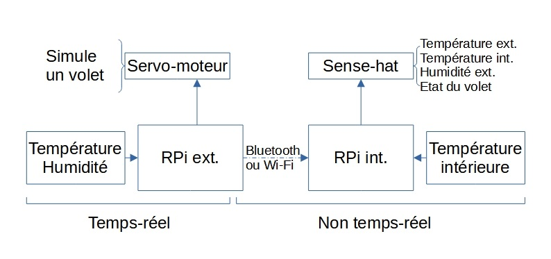

# Projet EB04 : Tom LADUNE

## Obligations

  - Projet de technologie embarquée
  - Le projet doit comprendre une partie temps réelle
  - Le projet doit utiliser au moins une Raspberry PI

## Cahier des charges

Le projet se propose d'être une station météorologique implémentant certains capteurs présent dans le kit. A savoir :
  - le capteur d'humidité et de température;
  - le servo-moteur (simulant une fenêtre);
  - et le sense hat (pour l'affichage et le capteur de température).

La station météorologique sera composé de deux Raspberry PI sur le même réseau. L'une d'elle commandera le module en extérieur et l'autre se chargera de l'affichage et de la mesure de température en intérieur.

## Technique

La commande des capteurs du module externe sera temps réelle. Les résultats des mesures seront ensuite transmis à la partie NRT, puis envoyé sur le réseaux à la 2ème RPI.

La deuxième RPI aura a sa charge la récupération des fichiers côté NRT et leur affichage sur la matrice LED du sens HAT. On pourra ajouté au bilan la température fourni par le sens HAT.

Si une différence de température trop grande est détecté entre l'intérieur et l'extérieur, la fenêtre se ferme ou s'ouvre.

## Bonus : IHM

Intégration d'une IHM permettant de monitorer l'installation. Soit depuis la Raspberry Pi interne soit une interface Web.
